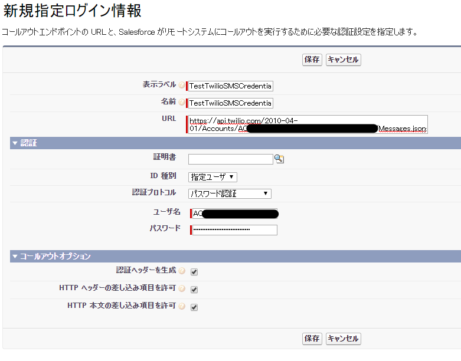
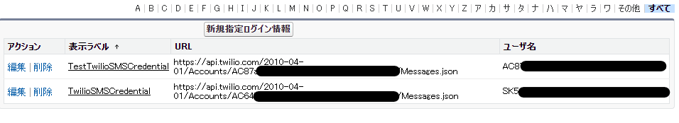

# インストール後設定手順

TerraSky-Twilioのインストール後設定手順を説明します。

## カスタム設定

### カスタム設定のレコードの新規作成

カスタム設定の一覧を表示し、TwilioSmsSettingが存在することを確認します。
新たにレコードを作成するためにManageをクリックします。

レコードを作成するため、新規ボタンを押します。

以下の値を入力し、保存します。

|  項目  | 必須/任意 |  入力内容  |
| ---- | ---- | ---- |
|  Name  |  必須  |  特定のSMS送信用とに沿った名前にすることを推奨します。  |
|  IsTest  |  必須  |  チェックなしの場合、実際にSMSが送信されます。チェックありの場合、Twilioのテスト用クレデンシャルを使用し、実際にSMS送信はされずにログだけが残ります。  |
|  MessagingServiceSID  |  必須  |  Twilioで作成したSMSのMessagingServiceSIDを入力します。例：MG***************************  |
|  TwilioDashboardUri  |  必須  | 活動履歴のログで使用するため、次のURLを入力します。 https://www.twilio.com |

!!! Tips
    カスタム設定は用途に合わせて複数作成可能です。MessagingServiceを複数作成し、用途によって送信元を変更する事が出来ます。

## 指定ログイン情報

新規に以下の２つの指定ログイン情報を作成します。

|  指定ログイン情報  | 概要 |
| ---- | ---- |
|  TwilioSMSCredential  |  実際にSMS送信が行われる指定ログイン情報  |
|  TestTwilioSMSCredential  |  テスト用クレデンシャルを用いて、実際にSMS送信を行わず結果だけを返す指定ログイン情報  |

### 指定ログイン情報TwilioSMSCredentialの作成

新規作成するため、新規指定ログイン情報ボタンをクリックします。

指定ログイン情報TestTwilioSMSCredentialを作成するため、以下の情報を入力し保存します。

|  項目  | 必須/任意 |  入力内容  |
| ---- | ---- | ---- |
|  表示ラベル  |  必須  |  TwilioSMSCredential ※固定の名前のため変更しないでください。 |
|  名前  |  必須  |  TwilioSMSCredential ※固定の名前のため変更しないでください。 |
|  URL  |  必須  |  https://api.twilio.com/2010-04-01/Accounts/[Account SID]/Messages.json ※[Account SID]にLIVE Credentials ACCOUNT SIDを入力してください。例：AC******* |
|  証明書  |  任意  | 任意で用意して下さい。 |
|  ID 種別  |  任意  | 指定ユーザを選択します。 |
|  認証プロトコル  |  任意  | パスワード認証を選択します。 |
|  ユーザ名  |  必須  | 作成したTwilio API KeyのSID　例：SK********** |
|  パスワード  |  必須  | 作成したTwilio API KeyのSECRET |
|  認証ヘッダーを生成  |  任意  | チェック |
|  HTTP ヘッダーの差し込み項目を許可  |  任意  | チェック |
|  HTTP 本文の差し込み項目を許可  |  任意  | チェック |

### 指定ログイン情報TestTwilioSMSCredentialの作成

新規作成するため、新規指定ログイン情報ボタンをクリックします。

指定ログイン情報TwilioSMSCredentialを作成するため、以下の情報を入力し保存します。

|  項目  | 必須/任意 |  入力内容  |
| ---- | ---- | ---- |
|  表示ラベル  |  必須  |  TestTwilioSMSCredential ※固定の名前のため変更しないでください。 |
|  名前  |  必須  |  TestTwilioSMSCredential ※固定の名前のため変更しないでください。 |
|  URL  |  必須  |  https://api.twilio.com/2010-04-01/Accounts/[Account SID]/Messages.json ※[Account SID]にTest Credentials TEST ACCOUNT SIDを入力してください。例：AC******* |
|  証明書  |  任意  | 任意で用意して下さい。 |
|  ID 種別  |  任意  | 指定ユーザを選択します。 |
|  認証プロトコル  |  任意  | パスワード認証を選択します。 |
|  ユーザ名  |  必須  | Test Credentials TEST ACCOUNT SID　例：AC********** |
|  パスワード  |  必須  | Test Credentials TEST AUTHTOKEN |
|  認証ヘッダーを生成  |  任意  | チェック |
|  HTTP ヘッダーの差し込み項目を許可  |  任意  | チェック |
|  HTTP 本文の差し込み項目を許可  |  任意  | チェック |

### 指定ログイン情報作成後確認

TwilioSMSCredentialと、TestTwilioSMSCredentialが作成されていれば完了です。

