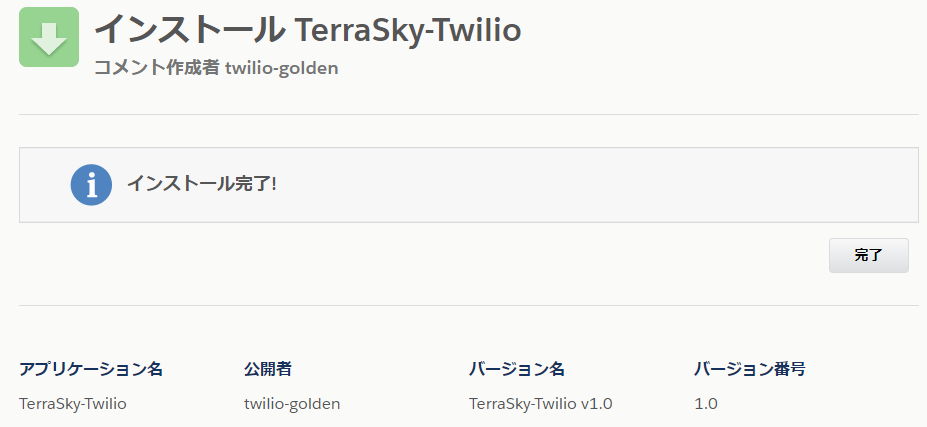

# パッケージのインストール

TerraSky-Twilioのインストール手順を説明します。

## 組織へのインストール手順

	
組織にパッケージをインストールするには、次の パッケージインストールをクリックします。

[パッケージインストール TerraSky-Twilio v1.1](https://login.salesforce.com/packaging/installPackage.apexp?p0=04t2w000002rdwy)

### インストール先組織へログイン

!!! Warning
    [パッケージのインストール|SALESFORCE ヘルプ](https://help.salesforce.com/articleView?id=distribution_installing_packages.htm&type=5) 
    Sandbox 組織にインストールする場合は、URL の最初の部分を http://test.salesforce.com に置き換える必要があります。またカスタムドメインを使用の場合は、そちらのURLに置き換える必要があります。

ログイン画面が表示されますので、パッケージをインストールしたい組織の情報を入力しログインします。

!!! Warning
    既に組織にログインしている場合は、ログイン画面が表示されずにインストール画面が表示されます。インストールしたい組織が異なる場合は、一度ログアウトしてからもう一度試してください。

### インストール

インストール画面が表示されるので、インストールしたいユーザを選択、同意のチェックボックスのチェックを入れて、インストールボタンを押下します。

完了画面が表示されたらインストールは成功です。
完了ボタンを押して終了します。

### インストール後確認

インストール済みパッケージ一覧に、パッケージ名「TerraSky-Twilio」が表示されていることを確認します。確認できたらインストールは完了です。

