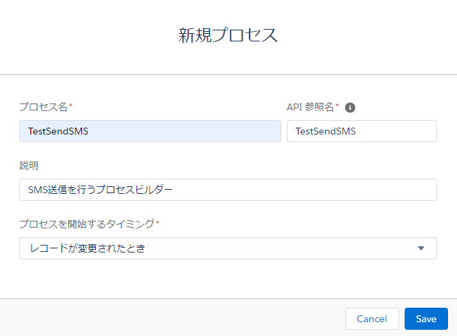
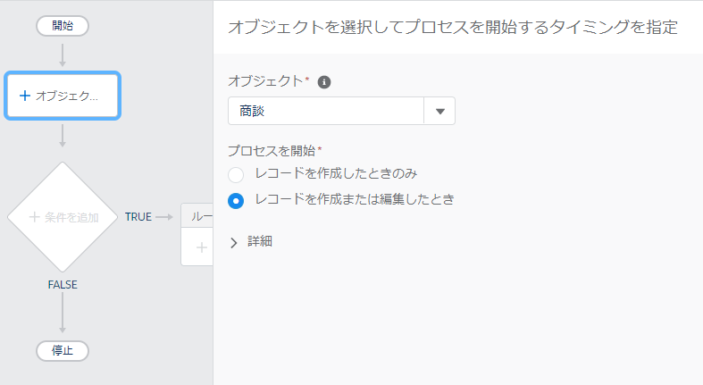
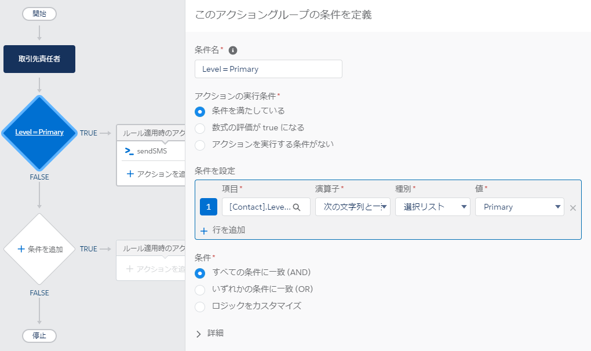
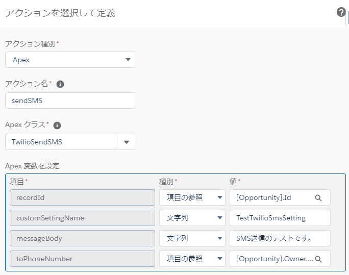
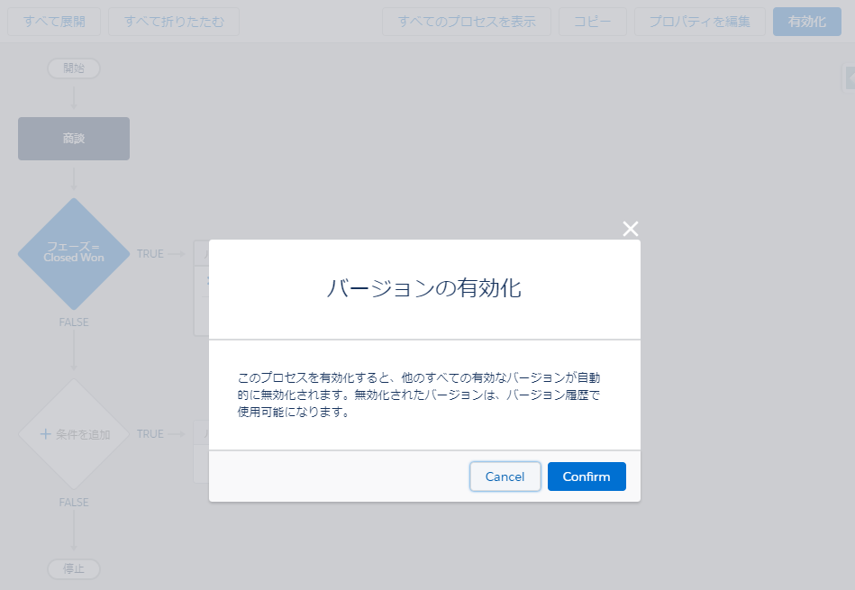
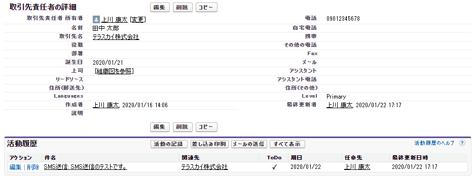

# プロセスビルダーによるSMS送信

プロセスビルダーによるSMS送信の実装方法について説明します。

## プロセスビルダーの構築

### プロセスビルダーの新規作成

プロセスビルダーを新規作成します。以下を参考に値を入力して下さい。

|  項目  | 必須/任意 |  入力内容  |
| ---- | ---- | ---- |
|  プロセス名  |  必須  |  任意の名前を入力して下さい。  |
|  API参照名  |  必須  |  任意の名前を入力して下さい。  |
|  説明  |  任意  |  プロセスビルダーの説明を任意で入力して下さい。  |
|  プロセスを開始するタイミング  |  必須  | プロセスビルダーの起動タイミングを選択してください。 |

### オブジェクトの選択

プロセスビルダーを起動するオブジェクトと開始タイミングを選択してください。

### 条件を追加

アクションを呼ぶための条件を定義してください。

### アクションを定義

アクションを呼ぶための条件を定義してください。

|  項目  | 必須/任意 |  入力内容  |
| ---- | ---- | ---- |
|  アクション種別 |  必須  |  Apexを選択して下さい。  |
|  アクション名  |  必須  |  任意の名前を入力して下さい。  |
|  Apex クラス  |  必須  |  TwilioSendSMSを選択して下さい。  |
|  toPhoneNumber |  必須  |  宛先の電話番号を入力して下さい。※現状、E.164 フォーマット（例：+819012345678）のみ対応可能. |
|  messageBody |  必須  |  SMSで送信するメッセージを入力して下さい。  |
|  customSettingName |  必須  |  カスタム設定「TwilioSmsSetting」で作成したレコードの「Name」を入力して下さい。  |
|  whatId |  任意  |  SMS送信の履歴を活動履歴として残したいオブジェクト(取引先、商談、キャンペーン、ケース、カスタムオブジェクトなど、人以外のオブジェクト)のIDを入力して下さい。  |
|  whoId |  任意  |  SMS送信の履歴を活動履歴として残したいオブジェクト(リードや取引先責任者など、人を表すオブジェクト)のIDを入力して下さい。  |

whoIdとwhatIdについてはこちらをご参照ください。
[Task|Salesforce開発者ガイド](https://developer.salesforce.com/docs/atlas.ja-jp.api.meta/api/sforce_api_objects_task.htm)

### プロセスビルダーの有効化

プロセスビルダーの作成が完了したら、最後に右上の有効化ボタン押します。
確認のポップアップが出ますので、Confirmを押して有効化します。

右上の有効化ボタンが無効化ボタンに変わっていれば完了です。

## プロセスビルダーの起動

先ほど、作成したプロセスビルダーを起動する条件になるようにレコードを更新します。プロセスビルダーで設定した宛先「toPhoneNumber」に対して、メッセージ「messageBody」が送信されます。TwilioのSMS送信キューに登録された段階で、プロセスビルダー作成の際に渡したパラメータ「recordId」に関連づく活動履歴が、SMS送信履歴として1件作成されます。

